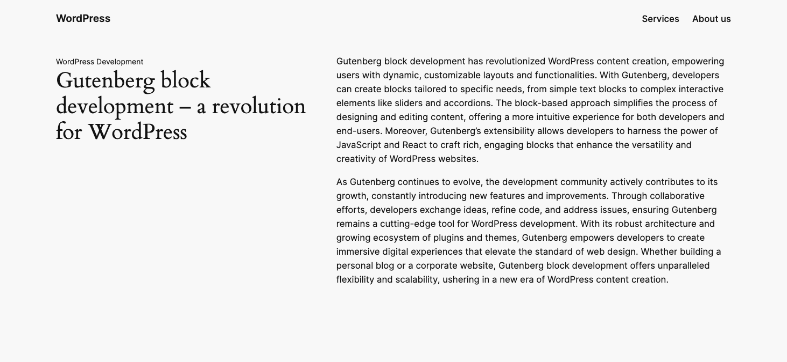

# Forty Sixty Block

This block was scaffolded with the Create Block tool.

## Description

This block displays two columns, the left one is approximately 40% in width and the right one is 60%. The left column has an optional tagling and a heading and the right column has the main content, which is created byt the editor using inner blocks. 

### Screenshot

Here's an example of this block being used in the Twenty Twenty-Four theme.

